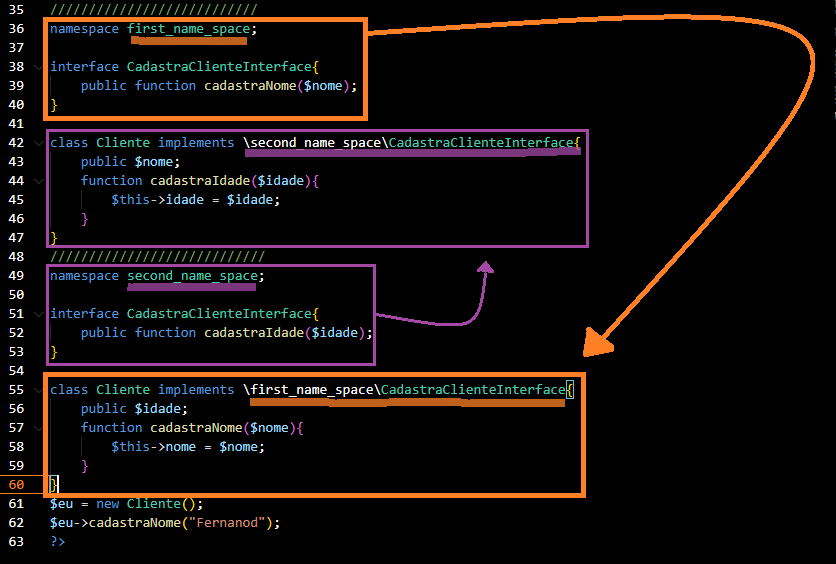

# PHP :elephant:

Estudos sobre PHP.

<h1> False, null e empty </h1>
Declare três variáveis, cada uma atribuídas respectivamente aos valores: null, "" e false.
Ao executar a verificação is_null(), somente a primeira variável, atribuída ao valor null, retornará true.<br>
Agora faça a verificação empty() em todas elas e verá que todas retornarão true.<br>
Portanto, o teste is_null() é true quando o valor é EXCLUSIVAMENTE null, <br>enquanto empty() é true quando o valor é tanto null quando vazio "" e quanto false
<br><br>
<h1> Método count()</h1>
Retorna o tamanho de um array.

<h1> Projeto Help Desk</h1>

<h3>Atributo action</h3>
Atributo HTML que determina para onde os dados do formulário serão enviados quando for dado o "submit".

<h3>Métodos de requisição HTTP</h3>
<ul>
  
  <li>
    <h4>GET</h4>
    Método que deve retornar apenas dados, ou seja, recuperar dados do servidor. Se nenhum valor é especificado para o atributo "method" no elemento form, então GET é tomado por padrão. Este método apresenta, na URL, o valor de todos aqueles elementos que haviam algum valor no atributo "name". Portanto, não deve-se utilizar esse método em formulários de login, uma vez que um input do tipo senha e name senha, aparecerá da seguinte maneira na URL: senha=123456. 
  </li>
  
  <li>
    <h4>POST</h4>
    Encaminha ao servidor dados armazenados no corpo do servidor. Método que faz o upload de um arquivo ou envio um formulário ao servidor, para    processamento ou armazenamento 
  </li>
</ul>

<h4>Importando script</h4>
Para importar scripts em diferentes códigos para aproveitar do reúso e manutenção de um código centralizado, pode-se fazer uso dos seguintes comandos:
<ul>
  <li>require</li>
  <li>require_once</li>
  <li>include</li>
  <li>include_once</li>
</ul>

São comandos um tanto redundantes, no entanto, a diferença está no fato de que o "require" faz com que ocorra um erro fatal caso haja algum problema com o script importado, isto impede o carregamento do resto da página. Já com o "include" é justamente o contrário, pois este só apresentará um warning em caso de erro, carregando o resto da página normalmente.

<h1>Método construtor</h1>
O método construtor se chama construct(). Ele é executado assim que o objeto é instanciado no código. Portanto, este método pode esperar argumentos que serão utilizado para preencher os atributos do objeto.

```java
<?php 
    class Aluno{
        public $name = null;
        public $age = null;
        public $failed = null;
        
        function __construct($name, $age, $failed){
            $this->name = $name;
            $this->age = $age;
            $this->failed = $failed;
        }

        function __set($atributo, $valor){
            $this->$atributo = $valor;
        }

        function __get($atributo){
            return $this->$atributo;
        }

        function printAll(){
            echo "name: " . $this->__get("name") . "<br>";
            echo "age: " . $this->__get("age") . "<br>";
            echo "failed: " . $this->__get("failed") . "<br>";
        }
    }
    //o método __construct() é executado assim que o objeto é instanciado
    $fernando = new Aluno("Fernando Ferreira", 20, "False");
    
    $fernando->printAll();
```

<h1> Métodos e atributos estáticos</h1>
Propriedades estáticas de uma classe podem ser acessadas diretamente, sem a necessidade de instaciação da classe 

```java
<?php
  class MyClass{
    public static $attr = "It's a static attribute!";
    
    public static function func(){
      echo "It's a static function!";
    }
    
    public function func2(){
      echo "It ISN'T a static function!";
    } 
    
  }
  
  //acessando propriedades da classe sem instanciá-la
  echo MyClass::$attr . "<br>";
  MyClass::func();
?>
```
Métodos não estáticos também podem ser acessados da mesma maneira que um método estático... No entanto, não é uma boa prática.
```java
<?php
  MyClass::func2();
?>
```
Vale ressaltar que o "operador de membro" (->) não pode ser usado no acesso às propriedades estáticas. <br>

E vale também lembrar que o operador $this não pode ser utilizado em métodos estáticos, uma vez que ele procura o escopo do objeto instanciado (atribuído a variável), para resgatar dali o valor do atributo que é passado logo em seguida, enquanto a ideia do método estático é justamente o contrário, pois recupera valores de atributos da classe sem ter a classe instanciada em um contexto de atribuição a variável. 
<br>
Caso o operador $this.attr seja utilizado em algum método, este método só pode ser chamado uma vez que a classe já tenha sido instanciada e atribuída a uma variável que será utilizada como chave.

<h1>Interfaces</h1>

Uma interface declara os métodos que devem obrigatoriamente ser sobrescritos nos objetos que implementam a interface. Ela exige que cada classe que a implanta, determine o comportamento dos métodos declarados em seu escopo, sobrescrevendo tais métodos.
<br>
```php
 <?php
    interface CalculaNota{
        //como estes métodos serão sobrescritos, não deve-se criar o corpo da função e nem seu escopo, abrindo e fechando chaves
        public function pegaNota();
        public function pegaTurma();
    }

    class Aluno implements CalculaNota{
        public $nome;
        public $serie;
        public $nota = 10;        
        function __construct($nome, $serie){
            $this->nome = $nome;
            $this->serie = $serie;
        }
        //sobrescrevendo métodos
        public function pegaNota(){
            return $this->nota; 
        }

        public function pegaTurma(){
            return $this->serie;
        }
    }

    $fernando = new Aluno("fernando", "3A");

    print_r($fernando->pegaNota());
?>
```
 <h1> Namespace </h1>
 
 Algumas vezes, ao importar bibliotecas para o código, podemos enfrentar problemas de funções,
classes e iterfaces com nomes iguais, criando assim, chaves duplicadas que resultam em erros.
<br>
No entanto, para não ter que renomear cada chave duplicada, podemos usar namespaces, que criam
escopos específicos que isolam um objeto e previne ele de entrar em conflito com outro objeto
que contém o mesmo nome.

```php
<?php
namespace my_code;
class Aluno{
    public $nota = 3;
    function reprovar(){
        echo 'reprovado';
    }
    function __constructor($name){
        $this->name = $name;
    }
}
//aqui foram dividos dois escopos, onde impede o conflito no nome das classes
namespace my_other_code;
class Aluno{
    public $nota = 9;
    function aprovar(){
        echo 'aprovado';
    }
    function __constructor($name){
        $this->name = $name;
    }
}
?>
```
Se instanciarmos Aluno em uma variável $fernando... Este aluno terá qual nota? 
```php
<?php
$fernando = new Aluno('Fernando');
echo $fernando->nota; // NOTA IGUAL A 9
?>
```
Ao analisarmos o código, veremos que a instância foi realizada dentro do escopo do namespace <strong>my_other_code</strong>, que possui a variável $nota atribuída ao valor 9... 
<br>
Mas e se quiséssemos instanciar com base na class Aluno no namespace <strong>my_code</strong>? 
<br>
Neste caso é necessário especificar o path, seguindo o modelo <strong> new \namespace_path\ClassName()</strong>;
```php
<?php
$fernando = new \my_code\Aluno('Fernando');
echo $fernando->nota; // NOTA IGUAL A 3
?>
```
Esse procedimento também pode ser feito com interfaces, veja a captura abaixo:
<br>

